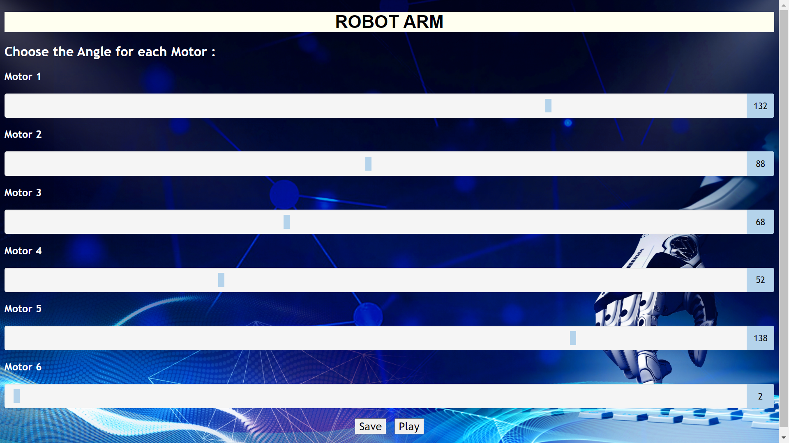

ROBOT ARM INTERFACE 
--------------------

CONTAIN 6 Motors each one have range slider  
choose angle for each motor
BUTTON SAVE > for save the valuse in database 
BUTTON PLAY > ON - OFF

### File : 
* [index.html](index.html)
* [final.php](final.php)
* [sstyle.css](sstyle.css)
* [java.js ](java.js)
* [robotarm.jpg](robotarm.jpg) 

واجهة تحكم لذراع روبوت يتحكم المستخدم في زاوية المحركات 0 - 180 درجة 
زر Save 

لحفظ قيم زوايا المحركات في قاعدة البيانات 
زر play 

لتشغيل المحركات 
قاعدة البيانات للمحركات تحتوي علي 7 اعمده
(id,motor1,motor2,motor3,motor4,motor5,motor6)

قاعدة بيانات لتشغيل الاذرع تحتوي على عامودين 
(id , ON/OFF)

### Interface : 

